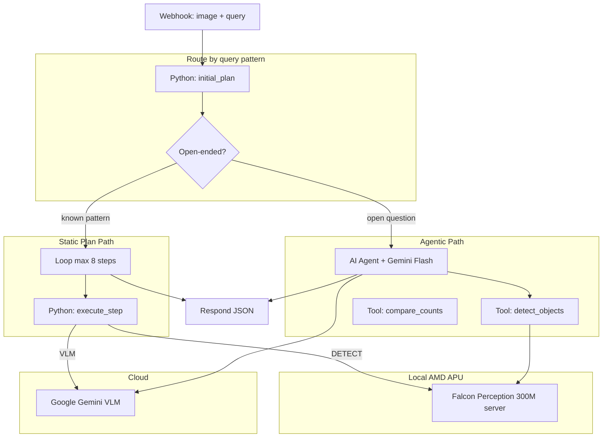

# Port Gemma4 Visual Agent to n8n (Python Runner + AI Agent)

## Implementation Checklist

- [ ] Create `n8n/` directory with Python modules, workflow JSON, runner Dockerfile, and README
- [ ] Deploy Falcon Perception **0.6B** sidecar on **R9700 (GPU 0)** via PyTorch + ROCm
- [ ] Port `agent_studio.py` logic to `n8n/python/` (`initial_plan`, tools, state, answer assembly) as importable modules
- [ ] Add `api_clients.falcon_detect()` calling local Falcon HTTP API (replace Replicate)
- [ ] Add Dockerfile + `n8n-task-runners.json` allowlisting `requests`, `Pillow`, `google-generativeai`
- [ ] Build Python Code sub-workflows for detect (local Falcon) and compare/crop/parse utilities
- [ ] Build static-plan branch: Python `initial_plan` → Loop → Python `execute_step` dispatcher
- [ ] Build agentic branch: AI Agent node with Gemini + Python/Workflow tools for detect, compare, VLM re-plan
- [ ] Wire main `vision-agent.json`: webhook → Switch-based step nodes → respond JSON with steps_html
- [ ] Add per-step visualization: step_meta.py, render.py, step_log.py, bbox images per step
- [ ] Write `n8n/README.md` with ROCm setup, Falcon server, credential config, and curl tests

---

## Review: Falcon Perception on AMD Hardware

### Your system (detected)

| Component | Details |
|-----------|---------|
| **CPU** | AMD Ryzen 9 7900X (12-core, 24 threads) |
| **Discrete GPU** | **AMD Radeon AI PRO R9700** (Navi 48 / RDNA 4, gfx1201) — **32 GB VRAM** |
| **Integrated GPU** | Raphael iGPU (gfx1036) — **512 MB** VRAM |
| **RAM** | 61 GB |
| **ROCm** | Installed — `torch 2.9.1+rocm6.3`, `torch.cuda.is_available() == True` |
| **Kernel** | 6.12.0 (Oracle Linux 10 UEK) |

**Important:** You are **not** limited to integrated graphics. Your **R9700 discrete GPU (32 GB)** is the right target for Falcon inference — it can comfortably run **0.6B with full segmentation masks**, not just 300M bboxes.

| Model | R9700 (GPU 0, 32 GB) | Raphael iGPU (GPU 1, 512 MB) |
|-------|----------------------|------------------------------|
| Falcon 300M (detection) | Trivial | Possible |
| Falcon 0.6B (detection + masks) | **Recommended** | Unlikely (VRAM too small) |

**Revised recommendation:** Deploy Falcon on **`cuda:0` / GPU 0 (R9700)** with `tiiuae/Falcon-Perception` (0.6B) and `task=segmentation` for full Studio-quality mask annotations.

### Multi-GPU plan: R9700 + RX 6500 XT 8GB

**Question:** Can RX 6500 XT 8GB run Falcon 0.6B + Qwen3-Embedding-0.6B together?

| Factor | Answer |
|--------|--------|
| **VRAM (both on 6500 XT)** | **Yes, likely fits.** Falcon ~1.2 GB + Qwen embed ~1.2–2 GB (bf16) + runtime ≈ **4–6 GB peak** — within 8 GB if both resident |
| **ROCm on RX 6500 XT** | **Unofficial / experimental.** Navi 24 (gfx1032) not on AMD's ROCm 7.1+ supported list. May need `HSA_OVERRIDE_GFX_VERSION=10.3.0` — less stable than R9700 |
| **Better layout** | **Split across GPUs** (recommended) |

#### Recommended GPU assignment

| GPU | VRAM | Role | Models |
|-----|------|------|--------|
| **R9700** (GPU 0) | 32 GB | Vision / Falcon sidecar | `Falcon-Perception` 0.6B (segmentation) |
| **RX 6500 XT** (GPU 2) | 8 GB | Embeddings | `Qwen/Qwen3-Embedding-0.6B` |

```bash
# Terminal 1 — Falcon on R9700
CUDA_VISIBLE_DEVICES=0 falcon-serve \
  --hf-model-id tiiuae/Falcon-Perception \
  --dtype bfloat16 --port 7860

# Terminal 2 — Qwen embedding on 6500 XT (if ROCm works)
CUDA_VISIBLE_DEVICES=2 \
  python embedding_server.py --model Qwen/Qwen3-Embedding-0.6B --port 7861
```

#### Alternative: both on R9700 (simplest)

Your R9700 has ~9 GB free VRAM right now (25/32 GB used). Both models total ~2.5–4 GB — **they fit on R9700 alone** without the 6500 XT:

```
R9700: Falcon 0.6B (:7860) + Qwen Embedding 0.6B (:7861)  — single GPU, official ROCm
6500 XT: unused, or display/output only
```

Use the 6500 XT only if you want **workload isolation** or to free R9700 VRAM for other jobs.

#### RX 6500 XT 8GB — performance expectations

Confirmed **8 GB SKU** (not the 4 GB variant). VRAM is comfortable for Falcon 0.6B (~1.2 GB weights + ~2–3 GB inference headroom). **Speed is unchanged vs 4 GB** — same RDNA 2 die and ~144 GB/s bandwidth; only memory headroom improves.

No published Falcon benchmarks on this GPU. Estimated from H100 official numbers (~350 ms/query) scaled by ~20× memory bandwidth gap:

| Scenario | Estimated time (warm) |
|----------|----------------------|
| First run (`--no-compile`) | 3–10 s |
| Single DETECT + masks | **2–8 s** |
| Full agent query (2× DETECT + COMPARE) | **5–20 s** |
| Same image, repeat query (HR cache) | **1–5 s** |

Fast enough for n8n webhook workflows; not suitable for real-time video. ROCm remains **experimental** (gfx1032) — benchmark after install:

```bash
# Run twice; second call = steady-state speed
time curl -X POST http://localhost:7860/detect \
  -H "Content-Type: application/json" \
  -d '{"image_b64":"...", "query":"car", "task":"segmentation"}'
```

#### RX 6500 XT ROCm caveats

Before relying on the 6500 XT for inference:

1. Verify detection: `CUDA_VISIBLE_DEVICES=2 python -c "import torch; print(torch.cuda.is_available())"`
2. If fails, try `export HSA_OVERRIDE_GFX_VERSION=10.3.0`
3. Expect **slower / less stable** than R9700 — community-supported, not production-tier
4. Falcon FlexAttention + `torch.compile` may fail on 6500 XT — use `--no-compile` as fallback

### Final GPU layout (Gemma + Falcon + Embedding)

| GPU | VRAM (actual) | Model | Notes |
|-----|---------------|-------|-------|
| **R9700** (GPU 0) | 32 GB (~9 GB free with Gemma) | **Gemma4 26B Q5** | Primary VLM — keep dedicated |
| **RX 6500 XT 8GB** (GPU 2, confirmed SKU) | 8 GB | **Falcon 0.6B** (segmentation) | Vision sidecar — no Gemma contention; VRAM not a constraint |
| **Raphael iGPU** (GPU 1) | **512 MB** dedicated | **Qwen Embedding 0.6B** | **Not recommended — see below** |

#### Can the integrated GPU run Qwen Embedding 0.6B?

**Tested on your Ryzen 9 7900X system:**

| Check | Result |
|-------|--------|
| `rocm-smi` dedicated VRAM | **512 MB** only (not enough for 1.2 GB+ model) |
| PyTorch reports | 30 GB (misleading — unified memory, not usable for ROCm alloc) |
| Actual GPU compute on iGPU | **Fails:** `HIP error: invalid device function` |
| ROCm gfx1036 (Raphael) | Not supported for PyTorch kernels in your ROCm 6.3 stack |

**Verdict: No — integrated GPU cannot reliably run Qwen embedding on this system today.**

The Raphael iGPU on 7900X is a 2-CU display adapter, not a compute GPU. Increasing iGPU VRAM in BIOS does not fix the `invalid device function` kernel error.

#### Recommended embedding options

| Option | Pros | Cons |
|--------|------|------|
| **A. CPU** (recommended) | Works now, 0.6B embed is fast on 7900X, zero VRAM impact | Not GPU-accelerated |
| **B. RX 6500 XT** | 8 GB plenty for embed alone | Only if Falcon runs elsewhere, or time-slice (unload one model) |
| **C. R9700 when Gemma idle** | Fast | Contends with Gemma VRAM — avoid |
| **D. iGPU** | — | **Does not work** with current ROCm/PyTorch |

**Recommended stack:**

```
R9700      → Gemma4 26B Q5 (:11434 or your port)     — VLM / re-planning
RX 6500 XT → Falcon 0.6B (:7860)                     — detection + masks
CPU        → Qwen3-Embedding-0.6B (:7861)             — embeddings for RAG
```

CPU embedding server example (sentence-transformers or vLLM CPU):

```bash
# Lightweight — no GPU needed for 0.6B embed
python -m embedding_server \
  --model Qwen/Qwen3-Embedding-0.6B \
  --device cpu \
  --port 7861
```

On 7900X with 61 GB RAM, expect **hundreds of embeddings/sec** — more than enough for n8n RAG branches.

#### Coexistence with Gemma 26B Q5 on R9700

**Your current R9700 state:** ~25.2 GB / 32 GB used (~**9 GB free**) with Gemma4 26B Q5 loaded.

| Component | VRAM estimate |
|-----------|---------------|
| Gemma 26B Q5 (resident) | ~23–25 GB (weights + KV cache) |
| Falcon 0.6B weights (bf16) | ~1.2 GB |
| Falcon inference spike | ~1–3 GB (activations; higher on first `torch.compile` run) |
| **Combined if both resident** | ~26–29 GB → **tight but possible** |

**Verdict: Maybe — sequential use only, not comfortable.**

| Scenario | Fits? |
|----------|-------|
| Falcon sidecar **always loaded** + Gemma idle during detect | **Likely yes** (~27 GB resident, ~5 GB headroom for Falcon inference) |
| Falcon detect **while Gemma is generating** | **Risky** — dual peak can OOM |
| First Falcon run with `torch.compile` | **Risky** — compile workspace can spike +1–2 GB |
| Falcon with `--no-compile` + bf16 | **Safer** on shared R9700 |

**Recommended if Gemma stays on R9700:**

1. **Best:** Run Falcon on **RX 6500 XT** (dedicated vision GPU) — zero contention with Gemma
2. **Acceptable:** Falcon on R9700 with `--no-compile`, monitor `rocm-smi` during first detect
3. **Avoid:** Simultaneous Gemma generation + Falcon detection on same GPU

If using local Gemma for n8n VLM (instead of cloud Gemini), agent steps are naturally **sequential** (DETECT → VLM), which helps — but both models stay **resident** in VRAM as sidecar services.

```bash
# Safer Falcon flags when sharing R9700 with Gemma
CUDA_VISIBLE_DEVICES=0 falcon-serve \
  --hf-model-id tiiuae/Falcon-Perception \
  --dtype bfloat16 \
  --no-compile --no-cudagraph \
  --port 7860
```

```
Vision webhook → Falcon (R9700) → detect/VLM steps
                      ↓
RAG branch → Qwen Embed (6500 XT or R9700) → vector store → retrieval
```

Embedding is a **separate sub-workflow** — not required for the core vision agent loop unless you add RAG over detection results or image captions.

```bash
# Target the discrete R9700, not the iGPU
CUDA_VISIBLE_DEVICES=0 falcon-serve \
  --hf-model-id tiiuae/Falcon-Perception \
  --dtype bfloat16 \
  --num-gpus 1 \
  --port 7860
```

### Verdict (original APU assumptions — superseded for your hardware)

Running **`tiiuae/Falcon-Perception-300M`** on integrated graphics was the conservative plan for a typical APU. **Your R9700 changes this:**

### Model comparison

| | Current repo (`Falcon-Perception` 0.6B) | Proposed (`Falcon-Perception-300M` 0.3B) |
|---|---|---|
| Params | ~0.6B | ~0.3B |
| Backend | MLX (Apple Silicon only) | PyTorch + ROCm (Linux AMD) |
| Tasks | Detection **+ segmentation masks** | **Detection only** (bounding boxes) |
| Output tokens | `<coord>` `<size>` `<seg>` | `<coord>` `<size>` |
| VRAM | ~1.2 GB float16 | ~0.6–1.2 GB (F32 on HF) |
| Edge fit | MacBook M-series | Ryzen APU / resource-constrained |

**Key limitation:** The 300M model **cannot produce pixel masks**. Calling `task="segmentation"` raises `ValueError`. The n8n workflow must use **bbox-only** detection and drop mask rendering from v1.

**What still works well:** Exact counting, spatial localization (bboxes), `COMPARE`, `DETECT_EACH`, crop-by-bbox. These are the core value props over Gemma-only.

**What is lost:** Semi-transparent mask overlays, `mask_area_px` / `mask_coverage` in JSON output, pixel-precise instance separation in crowded overlap scenes.

### AMD APU + ROCm feasibility

ROCm **7.2.1+** officially supports PyTorch on select **Ryzen APUs** (AI Max 300, select AI 400/300 series) on Linux. PyTorch uses `torch.cuda.is_available()` which maps to the AMD iGPU via HIP.

**Requirements to verify on your host:**

1. APU is on AMD's [supported hardware list](https://rocm.docs.amd.com/projects/radeon-ryzen/en/latest/)
2. Kernel **6.14-1018+** (your host reports 6.12 — may need a newer kernel for Ryzen ROCm)
3. ROCm 7.2.1 PyTorch wheels from `repo.radeon.com` (not generic PyPI torch)
4. Falcon needs **PyTorch 2.5+** with FlexAttention

**Falcon-specific ROCm caveats:**

- The official inference server uses `torch.compile` and **CUDA graph capture** — on ROCm, start with `--no-cudagraph` and test `compile=False` if kernels fail
- First inference call is slow (JIT compile); subsequent calls are faster
- FlexAttention on ROCm is supported in recent PyTorch but less battle-tested than NVIDIA CUDA

**Fallback:** If ROCm fails on your specific APU, CPU inference with `compile=False` works but expect **5–15s per detect** vs ~0.5–2s on GPU.

### Recommended deployment pattern

Run Falcon as a **persistent sidecar service** (not inside n8n Python runner — PyTorch + ROCm is too heavy for Code nodes):

```
┌─────────────────────┐     HTTP      ┌──────────────────────────┐
│  n8n (Python runner)│ ────────────► │ Falcon Perception Server │
│  AI Agent + Code    │  localhost    │ PyTorch + ROCm on APU    │
│  nodes              │  :7860        │ Falcon-Perception-300M   │
└─────────────────────┘               └──────────────────────────┘
         │
         ▼ cloud
   Google Gemini (VLM only)
```

n8n calls `http://falcon:7860/...` from Python Code nodes or HTTP Request nodes. VLM/reasoning stays on **Google Gemini** (cloud).

---

## Context

The current pipeline in [`agent_studio.py`](../agent_studio.py) runs locally on Apple Silicon via MLX. Target setup: **self-hosted n8n with native Python runner** on **Linux + AMD R9700 (32 GB)**, using:

- **Falcon Perception 0.6B** — local detection + **segmentation masks** on R9700 via ROCm sidecar
- **Python Code nodes** — port deterministic agent logic from `agent_studio.py`
- **AI Agent nodes** — visual reasoning and re-planning via Google Gemini (cloud)
- **Hybrid inference** — local Falcon for `DETECT`/`DETECT_EACH`, cloud Gemini for `VLM`/`VLM_PLAN`

## Architecture



| Original (`agent_studio.py`) | n8n implementation |
|------------------------------|-------------------|
| `_detect()` via MLX Falcon 0.6B | `falcon_detect()` → local HTTP API (300M, bbox-only) |
| `_vlm()` via Gemma 4 MLX | Google Gemini (AI Agent or Python API) |
| `initial_plan()` regex router | Python Code node |
| `VLM_PLAN` re-planning | AI Agent node (max 8 iterations) |
| `COMPARE`, `CROP`, `ANSWER` | Python Code nodes |

## Falcon Sidecar Setup

### Install (on AMD APU host)

```bash
# 1. Install ROCm 7.2.1 + PyTorch for Ryzen (see AMD docs)
# 2. Install falcon-perception with torch + server extras
pip install "falcon-perception[torch,server] @ git+https://github.com/tiiuae/falcon-perception.git"

# 3. Launch server with 300M model
falcon-serve \
  --hf-model-id tiiuae/Falcon-Perception-300M \
  --dtype bfloat16 \
  --num-gpus 1 \
  --no-cudagraph \
  --port 7860
```

Use `--no-compile` if FlexAttention compile fails on ROCm.

### Docker option

```yaml
# docker-compose.yml (alongside n8n)
services:
  falcon:
    image: ghcr.io/tiiuae/falcon-perception:latest  # or custom ROCm build
    devices:
      - /dev/kfd
      - /dev/dri
    group_add:
      - video
    environment:
      - HF_MODEL_ID=tiiuae/Falcon-Perception-300M
    ports:
      - "7860:7860"
```

> A custom Dockerfile extending AMD's ROCm PyTorch base may be needed — the stock Falcon server image targets NVIDIA CUDA.

### Detection API contract (for n8n)

Python Code node calls local server and normalizes to internal format:

```python
# Input
POST /detect  { "image_b64": "...", "query": "car", "task": "detection" }

# Output (normalized by n8n/python/api_clients.py)
{
  "count": 15,
  "detections": [
    { "bbox": [x1, y1, x2, y2], "center": {"x": 0.45, "y": 0.32} }
  ]
}
```

No `mask` field — downstream code must not expect masks.

## Python Runner Setup (n8n)

Lighter deps than Falcon sidecar — only HTTP client:

| Package | Purpose |
|---------|---------|
| `requests` | Call local Falcon server + Gemini API |
| `Pillow` | CROP logic, bbox rendering (optional) |
| `google-generativeai` | Gemini VLM from Python Code (static path) |

**Files to add:**

```
n8n/
├── docker-compose.yml           # n8n + falcon sidecar + runners
├── Dockerfile.runner
├── n8n-task-runners.json
├── falcon/
│   └── Dockerfile               # ROCm-based Falcon 300M server image
├── python/
│   ├── plan.py                  # initial_plan() — port of lines 285-375
│   ├── tools.py                 # crop, compare, parse_vlm_list, build_answer
│   ├── state.py                 # AgentState dataclass
│   ├── prompts.py               # REPLAN_PROMPT, VLM templates
│   └── api_clients.py           # falcon_detect() + gemini_vlm()
├── workflows/
│   ├── vision-agent.json
│   └── tools/
│       ├── detect.json          # Python → falcon_detect()
│       ├── execute-step.json
│       └── agent-tools.json
└── README.md
```

## Step Visualization

Goal: match the step-by-step cards from Vision Agent Studio (`STEP_META`, model badges, timing, annotated images) — visible both in the **n8n execution UI** and in the **webhook JSON response**.

### Three layers of visibility

| Layer | What you see | How |
|-------|-------------|-----|
| **1. n8n execution tree** | Each tool as its own node in Executions | Switch per tool type + named sub-workflows (not one monolithic Code node) |
| **2. Structured `steps[]` in JSON** | Machine-readable step log for downstream workflows | `step_meta.py` + append after every node |
| **3. `steps_html` in JSON** | Human-readable step cards (like the Studio UI) | Python renders HTML from `steps[]` using `STEP_META` colors/icons |

### Replace monolithic dispatcher with Switch routing

Instead of one **Python: Execute Step** inside the loop, use:

```
[Loop: steps]
  → [Switch: step.tool]
       ├─ DETECT      → [Execute Workflow: detect] → [Python: log_step + render_bboxes]
       ├─ DETECT_EACH → [Python: parse list] → [Loop objects] → [detect] → [log_step]
       ├─ VLM         → [HTTP/Gemini VLM]    → [Python: log_step]
       ├─ COMPARE     → [Python: compare]    → [Python: log_step + render_comparison]
       ├─ CROP        → [Python: crop]        → [Python: log_step + render_crop]
       └─ ANSWER      → [Python: build_answer]→ [Python: log_step]
  → [Python: merge state back into loop]
```

Each branch node gets a **descriptive name** visible in Executions:

| Node name on canvas | Example |
|---------------------|---------|
| `🔍 DETECT` | `🔍 DETECT: segment cars` |
| `🧠 VLM` | `🧠 VLM: analyze detections` |
| `⚖️ COMPARE` | `⚖️ COMPARE: cars vs people` |
| `✂️ CROP` | `✂️ CROP: largest dog` |
| `✅ ANSWER` | `✅ ANSWER: final` |

Use **Sticky Notes** on the canvas to group phases: `Planning`, `Detection`, `Reasoning`, `Output`.

### `step_log` schema (matches `vision_studio.py` SSE events)

Port `STEP_META` from [`agent_studio.py`](../agent_studio.py) lines 204-213 into `n8n/python/step_meta.py`:

```python
STEP_META = {
    "DETECT":      {"icon": "🔍", "color": "#6366f1", "model": "Falcon Perception", "model_size": "300M", "task": "Object Detection"},
    "DETECT_EACH": {"icon": "🔎", "color": "#818cf8", "model": "Falcon Perception", "model_size": "300M", "task": "Multi-class Detection"},
    "VLM":         {"icon": "🧠", "color": "#8b5cf6", "model": "Gemini Flash",      "model_size": "",     "task": "Visual Reasoning"},
    "CROP":        {"icon": "✂️", "color": "#f59e0b", "model": "—",                 "model_size": "",     "task": "Region Crop"},
    "COMPARE":     {"icon": "⚖️", "color": "#06b6d4", "model": "—",                 "model_size": "",     "task": "Count Comparison"},
    "ANSWER":      {"icon": "✅", "color": "#10b981", "model": "—",                 "model_size": "",     "task": "Final Answer"},
}
```

After every step node, a shared **Python: Log Step** node appends:

```json
{
  "step_index": 0,
  "tool": "DETECT",
  "label": "Segment 'cars'",
  "model": "Falcon Perception",
  "model_size": "300M",
  "task": "Object Detection",
  "color": "#6366f1",
  "duration_s": 0.8,
  "detail": "Found 15 instance(s) of 'car'",
  "image_b64": "data:image/jpeg;base64,...",
  "status": "complete"
}
```

Also emit a **plan preview** before the loop (like `type: "plan"` in SSE):

```json
{
  "plan": [
    {"tool": "DETECT", "label": "Segment 'cars'"},
    {"tool": "DETECT", "label": "Segment 'people'"},
    {"tool": "COMPARE", "label": "Compare counts"},
    {"tool": "ANSWER", "label": "Final answer"}
  ]
}
```

### Annotated images per step (`render.py`)

Port bbox drawing from `agent_studio.py` `_render_detections` (without masks):

| Step | Visual output |
|------|--------------|
| `DETECT` | Image with colored bboxes + count HUD |
| `DETECT_EACH` | Combined bbox overlay for all object types |
| `COMPARE` | Two-color overlay (cars=indigo, people=green) + count legend |
| `CROP` | Cropped region image |
| `VLM` | Current annotated image (or none) |

`render_bboxes(image_b64, detections, query)` → JPEG base64 data URI, attached to `step_log[].image_b64`.

### Where you see annotated images (per step)

**Yes — bbox annotations after each step are supported.** What you get depends on *where* you look:

| Where | Annotated image per step? | How |
|-------|---------------------------|-----|
| **Webhook JSON response** | Yes | Each `steps[i].image_b64` contains the image with bboxes drawn for that step |
| **`steps_html` in response** | Yes | Each step card embeds `` inline |
| **n8n Executions UI** | Partial | Click a **Log Step** or **Render Bboxes** node → output JSON shows `image_b64` string; n8n does not render inline image previews in the JSON panel by default |
| **n8n binary output** | Yes (with extra node) | After render, convert base64 → **binary** on the item so n8n shows a downloadable image thumbnail in the node output |
| **Slack / email / custom UI** | Yes | Post `steps_html` or attach `current_image_b64` per step |

#### Per-step visual output

| Step | Annotated image shows |
|------|----------------------|
| `DETECT` | All bboxes for that object + label (`car #1`, `car #2`) + count HUD |
| `DETECT_EACH` | Combined multi-color bboxes for all scanned object types |
| `COMPARE` | Two-color bboxes (e.g. cars=indigo, people=green) + legend with counts |
| `CROP` | Cropped zoomed region (no bboxes on crop itself) |
| `VLM` | Latest annotated image passed to Gemini (optional attach to step log) |
| `ANSWER` | Final composite image (all detections so far) |

#### Making images visible inside n8n Executions

Add a **Convert to File** or Python binary output after each **Render Bboxes** node:

```python
# After render_bboxes() — attach as n8n binary for UI thumbnail
import base64
img_bytes = base64.b64decode(image_b64.split(",", 1)[1])
return [{"json": {"step": step_log_entry}, "binary": {
    "annotated": {"data": img_bytes, "mimeType": "image/jpeg", "fileName": f"step_{i}_detect.jpg"}
}}]
```

In **Executions**, open the node → **Binary** tab to download or preview the JPEG.

#### Optional: image URLs instead of huge base64

For long workflows, base64 in JSON gets large. v2 option:

```
[Render Bboxes] → [Write Binary File / S3 Upload] → step_log[].image_url
```

Return URLs in `steps[]` so n8n and external UIs load images without bloating the webhook payload.

#### What you won't get (300M model)

- **Semi-transparent segmentation masks** — only bounding box rectangles (the full 0.6B MLX model provides masks)
- **Native n8n Studio-style live step cards** — n8n has no built-in SSE step UI; use `steps_html` in response or a small HTML page that consumes the webhook

### Annotation styles: lines, curves, and contours

**Short answer:** Lines and simple curves — **yes**, via custom drawing in `render.py`. Object-shaped curved outlines — **only with segmentation masks** (0.6B model), not from Falcon 300M bboxes alone.

Falcon 300M outputs **axis-aligned boxes** (center + width/height). It does not output curves or polygons. Any line/curve overlay is **custom Python drawing** (Pillow / OpenCV), not model output.

| Style | Possible with 300M? | How |
|-------|---------------------|-----|
| **Rectangle bbox** | Yes (default) | `draw.rectangle()` — 4 straight lines |
| **Corner brackets** | Yes | L-shaped corners at bbox vertices |
| **Crosshair / center dot** | Yes | `draw.line()` + `draw.ellipse()` at center |
| **Leader lines / arrows** | Yes | Lines between detections or to labels |
| **Elliptical outline** | Yes (approximate) | `draw.ellipse()` inscribed in bbox |
| **Circular arc** | Yes | `draw.arc()` / `draw.chord()` |
| **Bezier / smooth curves** | Yes (decorative) | Multi-point `draw.line()` or bezier library |
| **Polylines** | Yes | `draw.polygon()` or connected `draw.line()` |
| **Contour following object shape** | No (300M) / Yes (0.6B) | Mask → `cv2.findContours()` → draw closed polyline |
| **Semi-transparent fill** | No (300M) / Yes (0.6B) | Mask alpha composite |

#### Configurable `annotation_style` in webhook

```json
{
  "query": "Find all dogs",
  "image_b64": "...",
  "annotation_style": "corners"
}
```

Valid values: `bbox` | `corners` | `ellipse` | `crosshair` | `contour` (contour requires 0.6B + masks).

### 0.6B vs 300M — annotation advantages

| Annotation capability | 300M | 0.6B (`Falcon-Perception`) |
|----------------------|------|----------------------------|
| Bounding boxes | Yes | Yes |
| Semi-transparent mask fill | No | **Yes** — matches current Studio UI |
| Contour/curve following object edge | No | **Yes** — from mask via `findContours` |
| Per-instance color overlay on overlaps | Weak (boxes overlap) | **Strong** — each instance has its own mask |
| `mask_area_px` / `mask_coverage` in JSON | No (bbox area only) | **Yes** |
| Corner brackets / ellipses (manual styles) | Yes | Yes (same `render.py` code) |
| Visual quality in crowded scenes | Boxes only, hard to separate overlaps | **Pixel-precise** instance separation |
| Matches [`agent_studio.py`](../agent_studio.py) rendering | No | **Yes** — direct port of `_render_detections` |

**When 0.6B is worth it for annotation alone:**
- You care about **object-shaped overlays** (not just rectangles)
- Images have **overlapping instances** (people in crowds, stacked objects)
- You want the **same look** as Vision Agent Studio (colored mask + bbox)
- You need **contour** or **semi-transparent fill** annotation styles

**When 300M is enough:**
- Bboxes + corner brackets / labels are sufficient
- Simpler scenes, few overlaps
- Tighter VRAM budget on APU (~0.6B needs ~1.2 GB float16 vs ~0.6 GB for 300M)

**Cost of switching to 0.6B on your AMD APU:**
- ~2× model size → more VRAM pressure on integrated GPU; may require `bfloat16` or CPU fallback
- Same ROCm/PyTorch setup — only change `--hf-model-id tiiuae/Falcon-Perception` and `task=segmentation`
- `render.py` gains mask compositing (port existing `_render_detections` logic unchanged)

#### Contour curves (0.6B only)

```python
import cv2
contours, _ = cv2.findContours(mask.astype(np.uint8), cv2.RETR_EXTERNAL, cv2.CHAIN_APPROX_SIMPLE)
for cnt in contours:
    pts = [(int(p[0][0]), int(p[0][1])) for p in cnt]
    draw.line(pts + [pts[0]], fill=color, width=2)  # closed outline follows object shape
```

### HTML step cards in response

`format_response` generates `steps_html` using the same card layout as `_step_html()` in `agent_studio.py`:

```json
{
  "answer": "...",
  "plan": [...],
  "steps": [...],
  "steps_html": "<motion-div with step cards>",
  "current_image_b64": "..."
}
```

Downstream nodes (Slack, email, custom UI) can post `steps_html` directly.

### AI Agent path visualization

On the **AI Agent** node, enable:

- **Return Intermediate Steps** → captures each tool call + model reasoning in `intermediateSteps`
- **Automatically Passthrough Binary Images**

Post-process in **Python: Format Agent Response**:

```python
for i, action in enumerate(intermediate_steps):
    steps.append({
        "step_index": i,
        "tool": action["tool"],
        "label": f"Agent called {action['tool']}",
        "detail": action.get("toolInput", ""),
        "duration_s": None,
        "status": "complete"
    })
```

Map `detect_objects` → `DETECT`, `compare_counts` → `COMPARE` for consistent `STEP_META` styling.

### Sub-workflows for execution-tree depth

Each tool type gets its own sub-workflow so n8n Executions shows a nested tree:

```
vision-agent (main)
  └─ Loop iteration 1
       └─ Execute Workflow: detect
            └─ Python: falcon_detect
            └─ Python: render_bboxes
            └─ Python: log_step
```

Additional sub-workflows to add:

| File | Visible as |
|------|-----------|
| `tools/detect.json` | `🔍 Falcon Detect` |
| `tools/vlm.json` | `🧠 Gemini VLM` |
| `tools/compare.json` | `⚖️ Compare Counts` |
| `tools/render.json` | `🖼️ Render Bboxes` |

### Viewing steps in n8n UI

**During development:**
1. Open **Executions** → click a run → expand the Loop node
2. Each Switch branch shows as a separate green/red node with its own input/output JSON
3. Click any node to inspect `state.step_log` growing across iterations

**Pin data** on the Log Step node while debugging to freeze a step's output on the canvas.

**Optional: live progress** (v2) — add an HTTP Request node after each Log Step that POSTs `step_log[-1]` to a progress webhook (Slack, custom dashboard). This mimics SSE streaming from `vision_studio.py`.

### Updated response format

```json
{
  "query": "Are there more cars than people?",
  "answer": "More people (19) than cars (15).",
  "path": "static",
  "plan": [
    {"tool": "DETECT", "label": "Segment 'cars'"},
    {"tool": "DETECT", "label": "Segment 'people'"},
    {"tool": "COMPARE", "label": "Compare counts"},
    {"tool": "ANSWER", "label": "Final answer"}
  ],
  "steps": [
    {
      "step_index": 0,
      "tool": "DETECT",
      "label": "Segment 'cars'",
      "model": "Falcon Perception",
      "model_size": "300M",
      "task": "Object Detection",
      "color": "#6366f1",
      "duration_s": 0.8,
      "detail": "Found 15 instance(s) of 'car'",
      "image_b64": "data:image/jpeg;base64,...",
      "status": "complete"
    }
  ],
  "steps_html": "<motion-div>...</motion-div>",
  "current_image_b64": "data:image/jpeg;base64,...",
  "detections": { "car": { "count": 15, "instances": [...] } },
  "comparison": "More people (19) than cars (15)",
  "vlm_analysis": null,
  "total_duration_s": 3.2
}
```

### Files to add for visualization

```
n8n/python/
├── step_meta.py     # STEP_META dict + get_meta(tool)
├── render.py        # render_bboxes(), draw_corner_brackets(), draw_contours(), styles
├── step_log.py      # append_step(), build_plan_event(), steps_to_html()
└── ...
```

## Workflow Design

### Main workflow: `vision-agent.json`

**Trigger:** Webhook `POST /vision-agent`

```json
{ "query": "Are there more cars than people?", "image_b64": "data:image/jpeg;base64,..." }
```

1. **Python: normalize** — init `AgentState`
2. **Python: initial_plan** — regex router; set `is_open_ended`
3. **IF** → static or agentic path

#### Static path (with step visualization)

4a. **Python: emit plan** — add `state.plan` preview to output
5a. **Loop** (max 8) over `state.steps`
6a. **Switch** on `step.tool` → dedicated branch per tool (see Step Visualization section)
7a. Each branch ends with **Python: Log Step** (appends to `state.step_log`, renders bbox image)
8a. **Python: merge state** — pass updated state to next loop iteration

```python
# Each branch ends with log_step(state, tool, label, detail, image_b64=None)
state["step_log"].append({
    **get_meta(tool),
    "step_index": len(state["step_log"]),
    "label": label,
    "duration_s": round(time.time() - t0, 1),
    "detail": detail,
    "image_b64": render_bboxes(...) if tool in ("DETECT", "COMPARE") else None,
    "status": "complete",
})
```

#### Agentic path

4b. **AI Agent** (Gemini Flash, max 8 iterations):
- Tool `detect_objects` → sub-workflow calling `falcon_detect()`
- Tool `compare_counts` → Python Code Tool
- Built-in vision for scene Q&A

5. **Python: format_response** — build `steps`, `steps_html`, `current_image_b64`, `total_duration_s`

### Adaptations for bbox-only 300M

| Feature | Change |
|---------|--------|
| Mask overlays | Bbox rectangles only via `render.py` |
| `mask_area_px` in JSON | Use bbox area instead |
| `task="segmentation"` | Always `task="detection"` |
| Step card badge | `Falcon Perception (300M)` + `Object Detection` |

## AI Agent Configuration

Same as before — Gemini for VLM/reasoning. Detection tool description updated:

```
detect_objects(object): Run Falcon Perception locally. Returns exact count
and bounding boxes for all instances of the object. Does not return masks.
```

## Response Format

See **Step Visualization → Updated response format** above for the full schema with `plan`, `steps[]`, `steps_html`, and `current_image_b64`.

## Credentials

| Variable | Used by |
|----------|---------|
| `FALCON_API_URL` | Python `falcon_detect()` — default `http://localhost:7860` |
| `GEMINI_API_KEY` | AI Agent node + Python `gemini_vlm()` |

No Replicate token needed.

## Testing Plan

1. Verify ROCm: `python -c "import torch; print(torch.cuda.is_available())"` → `True`
2. Start Falcon 300M server, test detect on [`test_data/street.jpg`](../test_data/street.jpg) with query `"car"`
3. Import n8n workflows, configure env vars
4. Static path: `"Are there more cars than people?"` → dual DETECT + COMPARE
5. Agentic path: `"What is happening in this image?"` → AI Agent tool calls
6. Benchmark: compare detect latency GPU vs CPU fallback

## Limitations

- **No segmentation masks** — 300M is detection-only; use full `Falcon-Perception` 0.6B on CUDA if masks are required later
- **ROCm kernel compatibility** — FlexAttention + compile may need flags disabled on some APUs
- **Kernel version** — Ryzen ROCm may require kernel 6.14+; verify against your el10uek 6.12 host
- **Gemini still cloud** — VLM/reasoning not local; only detection is on-device
- **First-call latency** — `torch.compile` warmup on first detection

## How to Integrate as a New n8n Workflow

This section is the practical guide for adding the vision agent to your self-hosted n8n instance.

### Prerequisites (one-time setup)

1. **Falcon sidecar running** and reachable from n8n (same host or Docker network):

   ```bash
   curl http://localhost:7860/health   # should return OK once server is up
   ```

2. **n8n with native Python runner** enabled (`N8N_NATIVE_PYTHON_RUNNER=true`, external task runners if using Docker)

3. **Google Gemini credential** in n8n (Settings → Credentials → Google Gemini / PaLM API)

4. **Environment variables** on the n8n container:

   | Variable | Example |
   |----------|---------|
   | `FALCON_API_URL` | `http://falcon:7860` (Docker) or `http://host.docker.internal:7860` |
   | `GEMINI_API_KEY` | your Google AI key |

### Workflow package (3 workflows to import)

Import in this order — sub-workflows must exist before the main workflow references them:

| Order | File | Purpose |
|-------|------|---------|
| 1 | `workflows/tools/detect.json` | `detect_objects` — calls Falcon HTTP API |
| 2 | `workflows/tools/agent-tools.json` | `compare_counts` — Python Code Tool |
| 3 | `workflows/vision-agent.json` | Main webhook workflow |

**Import steps in n8n UI:**

1. Open n8n → **Workflows** → **Add workflow** → **⋯ menu** → **Import from File**
2. Import `detect.json` first, note the workflow ID
3. Import `agent-tools.json`
4. Import `vision-agent.json`
5. Open the main workflow and verify **Call n8n Workflow Tool** nodes point to the correct sub-workflow IDs (re-link if IDs changed on import)

### Canvas layout (main workflow nodes)

Build top-to-bottom on the n8n canvas:

```
[Webhook] → [Python: Normalize] → [Python: Initial Plan] → [Python: Emit Plan]
                                                                    ↓
                                                          [IF: is_open_ended?]
                                    ┌───────────────────────────────┴──────────────────────────┐
                                    ▼                                                          ▼
                          [Loop: steps, max 8]                                  [AI Agent + Gemini Flash]
                                    ↓                                              (Return Intermediate Steps)
                          [Switch: step.tool]                                                    ↓
                           ├─ 🔍 DETECT → [sub-wf] → [Log Step]                  [Python: Format Agent Steps]
                           ├─ 🔎 DETECT_EACH → [loop] → [Log Step]                              ↓
                           ├─ 🧠 VLM → [sub-wf] → [Log Step]                     [Python: Log Step]
                           ├─ ⚖️ COMPARE → [Log Step]                                           ↓
                           ├─ ✂️ CROP → [Log Step]                                              │
                           └─ ✅ ANSWER → [Log Step]                                            │
                                    ↓                                                          │
                          [Python: Merge State] ←──────────────────────────────────────────────┘
                                    ↓
                          [Python: Format Response + steps_html]
                                    ↓
                          [Respond to Webhook]
```

#### Node configuration details

**1. Webhook** (trigger)
- Method: `POST`
- Path: `vision-agent`
- Response mode: **Using 'Respond to Webhook' node**
- Binary data: enable if accepting file uploads later

**2. Python: Normalize Input**
- Language: **Python**
- Mode: Run Once for All Items
- Reads `body.query` and `body.image_b64` (or `body.image_url` → fetch and encode)
- Outputs single item with `state` JSON blob

**3. Python: Initial Plan**
- Calls `initial_plan(query)` from ported logic
- Sets `state.steps` and `state.is_open_ended`

**4. IF node**
- Condition: `{{ $json.state.is_open_ended }}` is `true` → agentic branch, else static

**5a. Static path — Loop + Switch**
- Loop over `state.steps`, max 8
- **Switch** routes to per-tool branches (not one Code node)
- Each branch ends with **Python: Log Step** (timing, detail, bbox image)
- See **Step Visualization** section for node naming and `step_log` schema

**5b. Agentic path — AI Agent node**
- Chat model: **Google Gemini** → `gemini-2.0-flash`
- Enable: **Return Intermediate Steps** + **Automatically Passthrough Binary Images**
- Max iterations: 8
- Post-process with **Python: Format Agent Steps** → maps tool calls to `step_log` entries

**6. Python: Format Response**
- Builds `steps[]`, `steps_html`, `current_image_b64`, `total_duration_s`
- Merges static loop output or agent output into unified JSON schema

**7. Respond to Webhook**
- Returns formatted JSON to caller

### Sub-workflow: `detect.json`

Minimal 2-node workflow:

```
[Execute Workflow Trigger] → [Python: falcon_detect]
```

- Trigger: **When called by another workflow** (passthrough input)
- Python node calls `POST {{ $env.FALCON_API_URL }}/detect` with `image_b64` + `query`
- Returns `{ count, detections: [...] }`

Expose to AI Agent via **Call n8n Workflow Tool** with description:
> Detect and count all instances of an object in the image. Input: object name (string). Returns count and bounding boxes.

### Wiring tools to the AI Agent

On the **AI Agent** node canvas, connect tool sub-nodes below it:

```
                    [Google Gemini Chat Model]
                              │
                         [AI Agent]
                         /        \
            [Call n8n Workflow Tool]  [Code Tool: compare_counts]
                 detect.json
```

In the **Call n8n Workflow Tool** node:
- Select workflow: `Vision Agent — Detect`
- Description: let the agent know when to call it (counting, localization)
- Use `$fromAI()` for the `object` parameter if using dynamic tool inputs

### Activate and test

1. **Save** all three workflows
2. **Activate** the main `vision-agent` workflow (toggle top-right)
3. Copy the webhook URL from the Webhook node (e.g. `https://n8n.example.com/webhook/vision-agent`)
4. Test with curl:

```bash
# Encode a test image
IMG_B64=$(base64 -w0 test_data/street.jpg)

curl -X POST https://your-n8n-host/webhook/vision-agent \
  -H "Content-Type: application/json" \
  -d "{\"query\": \"Are there more cars than people?\", \"image_b64\": \"data:image/jpeg;base64,${IMG_B64}\"}"
```

Expected: JSON with `answer`, `detections`, `path: "static"`.

### Calling from another n8n workflow

To chain this into an existing automation:

```
[Google Drive: download image] → [HTTP Request: POST /webhook/vision-agent] → [Slack: post answer]
```

Or use **Execute Workflow** node (instead of webhook) if you want internal calls without HTTP:

- Add an **Execute Workflow Trigger** to the main workflow (or a thin wrapper)
- Call from any workflow with `{ query, image_b64 }`

### Docker Compose (all services together)

```yaml
services:
  n8n:
    image: n8nio/n8n
    environment:
      - N8N_RUNNERS_ENABLED=true
      - N8N_NATIVE_PYTHON_RUNNER=true
      - FALCON_API_URL=http://falcon:7860
      - GEMINI_API_KEY=${GEMINI_API_KEY}
    ports:
      - "5678:5678"
    volumes:
      - n8n_data:/home/node/.n8n
      - ./n8n/python:/opt/runners/task-runner-python/n8n_agent:ro
      - ./n8n/n8n-task-runners.json:/etc/n8n-task-runners.json:ro

  n8n-runners:
    build:
      context: ./n8n
      dockerfile: Dockerfile.runner
    environment:
      - N8N_RUNNERS_AUTH_TOKEN=${N8N_RUNNERS_AUTH_TOKEN}

  falcon:
    build:
      context: ./n8n/falcon
    devices: ["/dev/kfd", "/dev/dri"]
    group_add: ["video"]
    ports:
      - "7860:7860"
```

### Troubleshooting

| Problem | Fix |
|---------|-----|
| Python import blocked | Add package to `n8n-task-runners.json` allowlist |
| Falcon connection refused | Check `FALCON_API_URL`; use Docker service name not `localhost` |
| AI Agent loops same tool | Add "do not re-call same tool" to system prompt |
| `torch.cuda.is_available()` False | ROCm not installed or APU not on supported list — try CPU fallback |
| Workflow tool not found after import | Re-link Call n8n Workflow Tool to correct sub-workflow |

## Optional v2

- Upgrade to `Falcon-Perception` 0.6B if you add a discrete AMD GPU with enough VRAM
- Local Gemma via Ollama/ROCm to remove Gemini cloud dependency
- **Live step streaming**: HTTP POST after each Log Step to Slack/webhook (SSE-like progress)
- Hybrid Mac MLX server for full segmentation masks while n8n orchestrates
